<div align="center">


# Steem Tools

**A Chrome extension packed with handy tools for [Steem](https://steemyy.com) users** —
blockchain & account insights, delegations, downvotes, witness lookup, a Steem-JS
console, a multi-send wallet and more.

[](https://github.com/DoctorLai/SteemTools/actions/workflows/ci.yml)
[](https://nodejs.org)
[](manifest.json)
[](https://prettier.io)
[](CONTRIBUTING.md)
[](https://deepwiki.com/DoctorLai/SteemTools)

[](LICENSE)
[](https://github.com/DoctorLai/SteemTools/commits)
[](https://github.com/DoctorLai/SteemTools/commits)
[](https://github.com/DoctorLai/SteemTools)
[](https://github.com/DoctorLai/SteemTools)
[](https://github.com/DoctorLai/SteemTools/issues)
[](https://github.com/DoctorLai/SteemTools/pulls)
[](https://github.com/DoctorLai/SteemTools/stargazers)
[](https://github.com/DoctorLai/SteemTools/network/members)
[](https://github.com/DoctorLai/SteemTools/watchers)

[](https://chrome.google.com/webstore/detail/steem-tools/emjfpeecopppojbhkigjjmcahbfahhbn)
[](https://chrome.google.com/webstore/detail/steem-tools/emjfpeecopppojbhkigjjmcahbfahhbn)
[](https://chrome.google.com/webstore/detail/steem-tools/emjfpeecopppojbhkigjjmcahbfahhbn)
[](PRIVACY.md)

</div>

## Table of contents

- [Install](#install)
- [Features](#features)
- [Screenshots](#screenshots)
- [Development](#development)
- [Project structure](#project-structure)
- [Manifest version](#manifest-version)
- [Privacy](#privacy)
- [Contributing](#contributing)
- [Support](#support)
- [License](#license)

## Install

**From the Chrome Web Store (recommended):**

👉 [Steem Tools on the Chrome Web Store](https://chrome.google.com/webstore/detail/steem-tools/emjfpeecopppojbhkigjjmcahbfahhbn)

**From source (for development / the latest code):**

1. Download or clone this repository.
2. Open `chrome://extensions` in Chrome.
3. Enable **Developer mode** (top-right).
4. Click **Load unpacked** and select the repository folder (the one containing
   `manifest.json`).

## Features

- **Blockchain information** — head block, hardfork version, feed/market price and more.
- **Account insights** — voting power & HF20 voting mana with a "full in" estimate,
  reputation, estimated account value and curation stats.
- **Watch your friends** — pin extra account ids to see their VP, reputation and value
  at a glance.
- **Delegations** — delegate Steem Power via SteemConnect and look up any account's
  **delegators** and **delegatees**.
- **Downvotes** — see who downvoted you, and review the downvotes you have cast.
- **Witnesses** — witness lookup, the top active witnesses, and the witnesses you vote
  for (with one-click unvote).
- **Deleted comments** — reveal deleted comments/posts for any account.
- **Power down** — check any account's power-down schedule.
- **Reputation calculator** — convert a raw reputation into the friendly number.
- **Steem-JS console** — run [steem.js](https://github.com/steemit/steem-js) snippets
  right in the popup, with save/load, download and a full-screen editor.
- **Multi-send wallet** — send SBD/STEEM to many recipients at once, with a
  `[username]` memo template.
- **Node & API tools** — server/node status and ping tests for Steem RPC nodes.
- **Front-end switcher** — a right-click context menu to jump between Steem front-ends
  (steemit.com, busy.org, steemd.com, steemdb.com, steemhunt.com, …).
- **Resteems inline** — shows the list of resteems directly on supported Steem post
  pages.
- **Localised** — Chrome Web Store listing translated into 25+ languages (English,
  Chinese, Spanish, Hindi, Arabic, Portuguese, Russian, Japanese, German, French,
  Korean and more).

## Screenshots

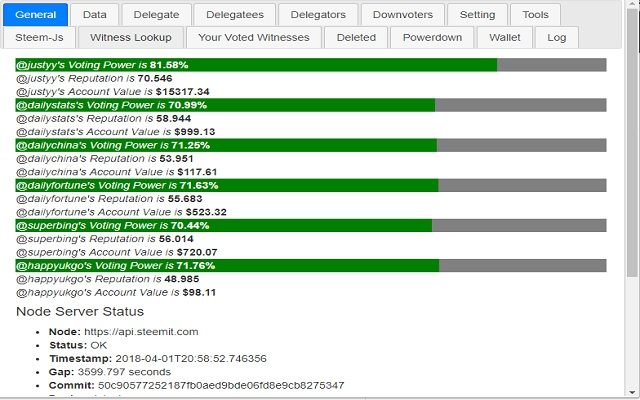
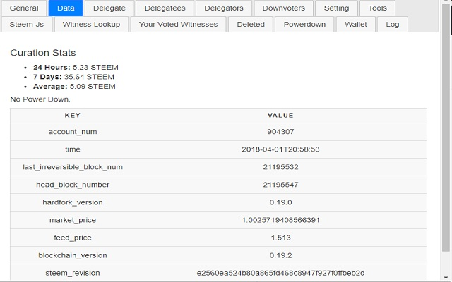
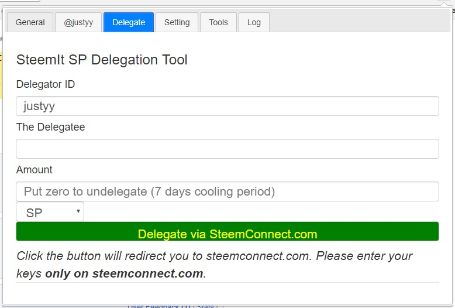

<details>
<summary>More screenshots</summary>

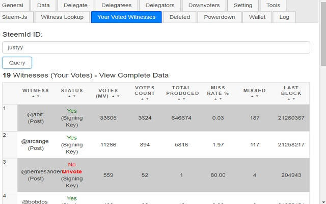
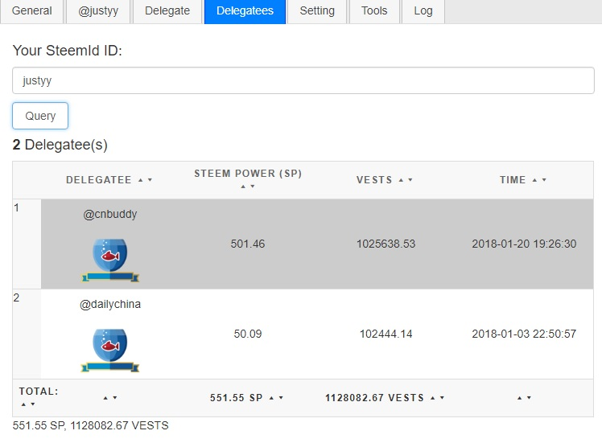
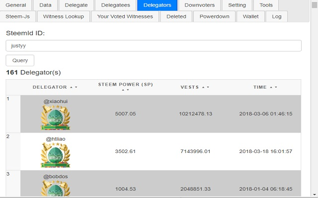
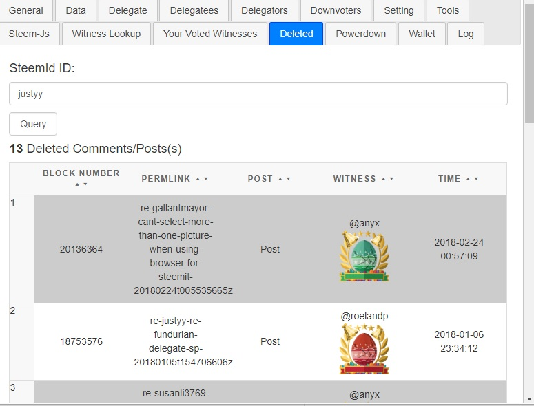
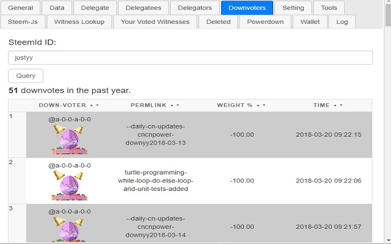
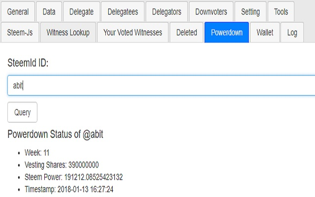
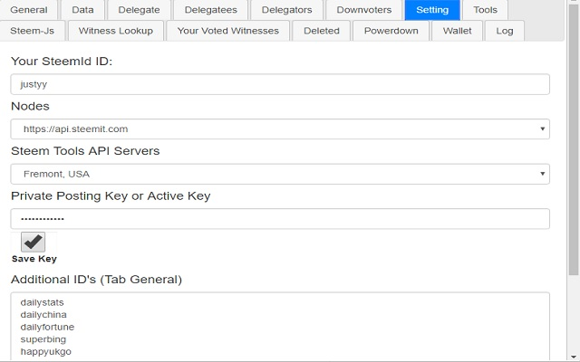
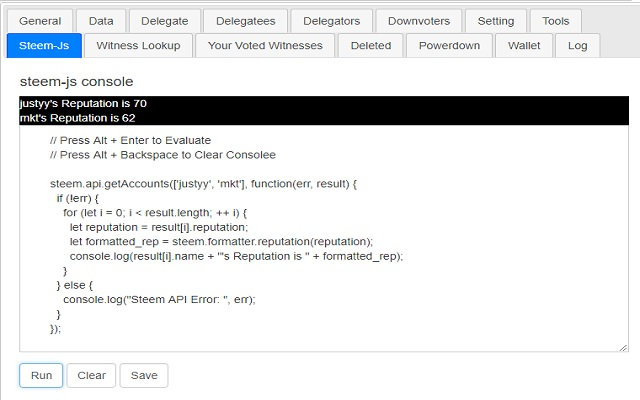
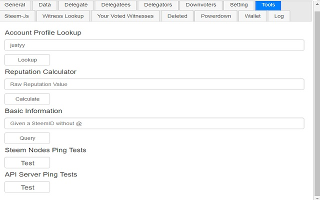
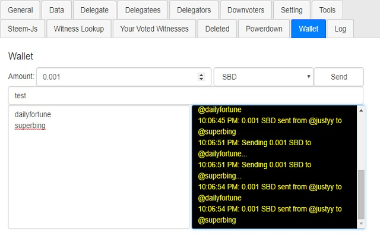
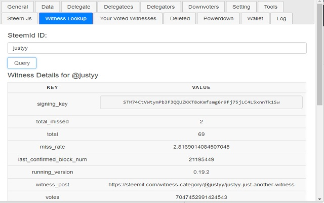

</details>

## Development

The extension is plain HTML/CSS/JavaScript with no bundler. Node.js (>= 20) is only
required for the development tooling (linting, formatting, tests and packaging).

```bash
# install dev dependencies
npm install

# run the full quality gate (lint + format check + tested coverage)
npm run check

# build a Chrome Web Store-ready zip into dist/
npm run build
```

| Script                  | Description                                         |
| ----------------------- | --------------------------------------------------- |
| `npm run lint`          | Lint the source with ESLint                         |
| `npm run lint:fix`      | Auto-fix lint issues where possible                 |
| `npm run format`        | Format the source with Prettier                     |
| `npm run format:check`  | Verify formatting without writing changes           |
| `npm test`              | Run the Jest unit tests                             |
| `npm run test:coverage` | Run the tests and enforce the coverage threshold    |
| `npm run check`         | Lint + format check + tested coverage (the CI gate) |
| `npm run build`         | Produce a Web Store-ready zip in `dist/`            |

Unit tests live in `tests/` and cover the pure helpers in `js/functions.js`,
`js/content.js`, `js/ping.js`, `js/context.js` and `js/sandbox.js`; the coverage
threshold is enforced by `npm run test:coverage` (and in CI).

See [CONTRIBUTING.md](CONTRIBUTING.md) for the full workflow.

## Project structure

```text
.
├── manifest.json      # Chrome extension manifest (Manifest V3)
├── main.html          # popup UI (jQuery UI tabs)
├── sandbox.html       # sandboxed page that runs the Steem-JS console
├── icon.png           # toolbar icon
├── _locales/          # i18n message catalogues
├── css/               # custom + vendored styles
├── bs/                # Bootstrap (vendored)
├── images/            # icons, banners and screenshots
├── js/
│   ├── functions.js   # pure helpers (unit-tested)
│   ├── content.js     # content script: resteems + domain checks (unit-tested)
│   ├── context.js     # right-click context menu / front-end switcher (unit-tested)
│   ├── background.js  # service worker (MV3 background)
│   ├── sandbox.js     # Steem-JS console runner for the sandboxed page (unit-tested)
│   ├── ping.js        # latency helper (unit-tested)
│   ├── steemtools.js  # popup logic
│   └── *.min.js …     # vendored libraries (jQuery, steem.js, Chart.js, …)
├── scripts/build.js   # packages the extension into dist/*.zip
└── tests/             # Jest unit tests
```

Only the project's own source is linted, formatted and tested; the vendored
libraries in `js/`, `bs/` and `css/` are excluded.

## Manifest version

Steem Tools ships as a **Manifest V3** extension, so it installs on current
versions of Chrome and Edge. Two features that MV3 restricts are handled as
follows:

- the **Steem-JS console** evaluates user code with `eval()`, which MV3 forbids on
  extension pages, so it runs inside a dedicated **sandboxed page**
  (`sandbox.html` / `js/sandbox.js`) that communicates with the popup via
  `postMessage`, and
- the **front-end switcher** uses a single `chrome.contextMenus.onClicked`
  listener (MV3 dropped the per-item `onclick` callback), with the menus created
  in `chrome.runtime.onInstalled`.

The background logic runs as a **service worker** (`js/background.js`, which
`importScripts` the context-menu wiring in `js/context.js`).

## Privacy

Steem Tools does not use analytics or trackers. Your private keys are only ever used
locally in your browser to sign transactions and are stored **only** if you explicitly
choose _Save Key_. See the full [Privacy Policy](PRIVACY.md).

## Contributing

Bug reports, feature requests and pull requests are very welcome — please read
[CONTRIBUTING.md](CONTRIBUTING.md) first. By participating you agree to abide by
our [Code of Conduct](CODE_OF_CONDUCT.md).

## Support

If you find Steem Tools useful, consider supporting the author:

- 💜 [PayPal](https://www.paypal.me/doctorlai/5)
- ₿ [Bitcoin](https://buymeacoffee.com/y0btg5r/crypto-payment-accepted)
- ☁️ Referral links for [Vultr](https://justyy.com/out/vultr2) and
  [Linode](https://justyy.com/out/linode) VPS

## License

Released under the [MIT License](LICENSE) — Copyright (c) [@justyy](https://steemit.com/@justyy).

Built with ❤️ by [@justyy](https://steemyy.com) ·
[GitHub](https://github.com/DoctorLai/SteemTools)
